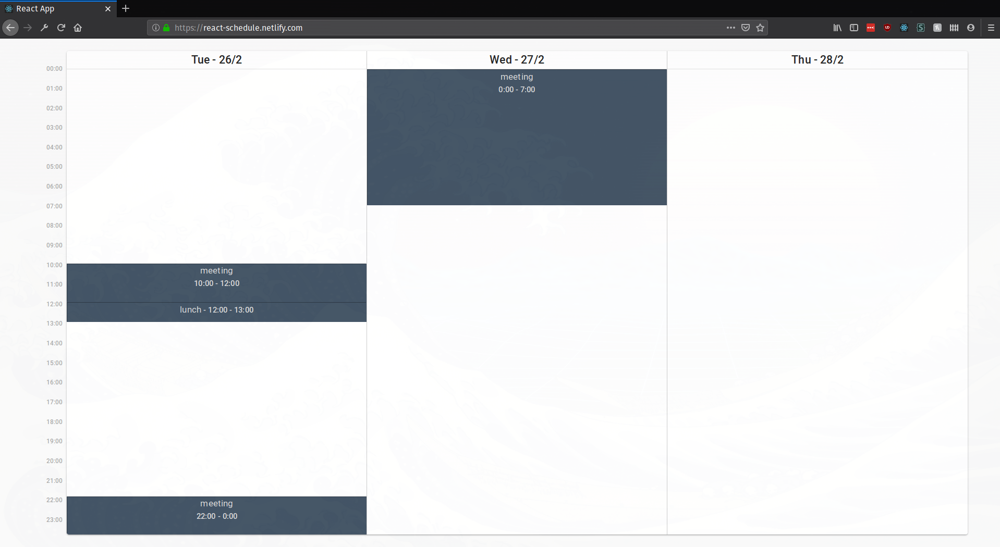
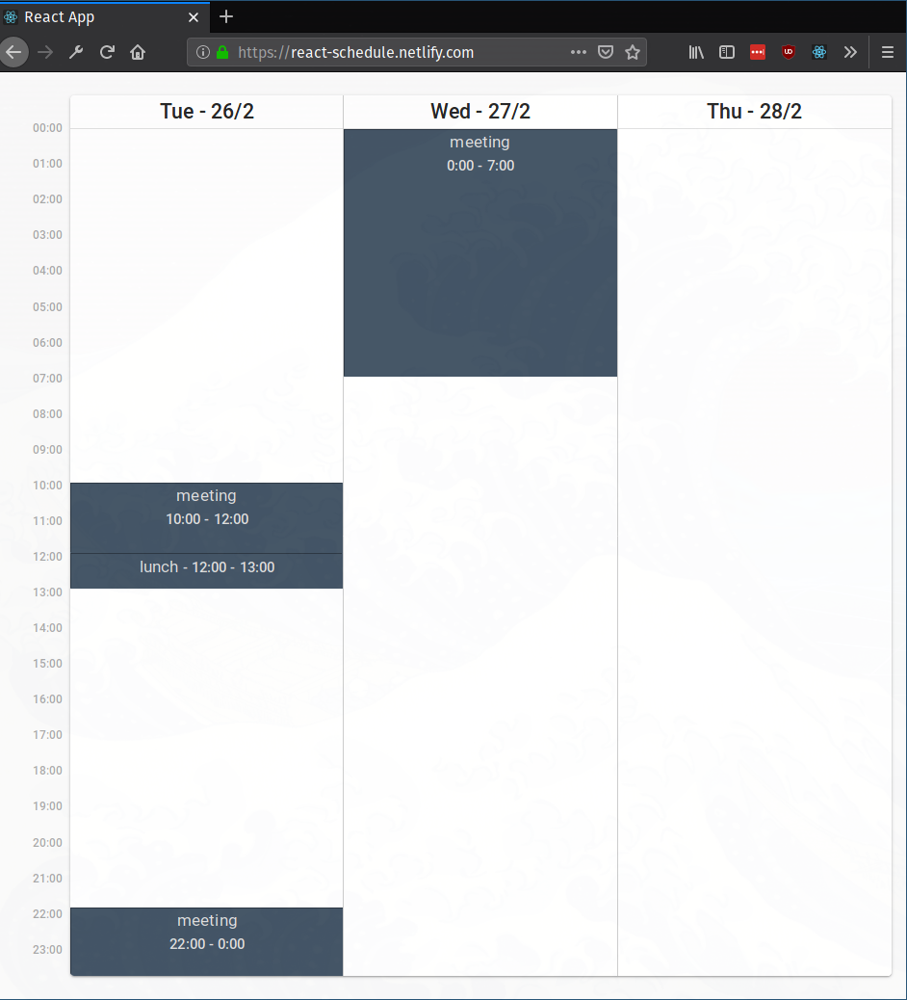
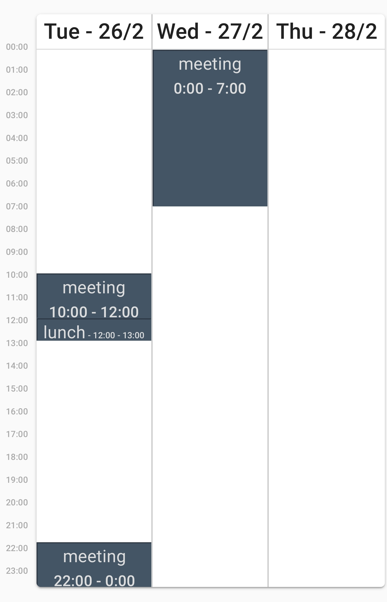

# React Schedule
The most recent version of this page can be found [here](http://react-schedule.netlify.com).

## Built with
  * React.js (Create React App)
  * Material UI
  * Typescript
  * date-fns

## Setup
To get a development version up and running open your terminal and run

``` shell
npm start
```
This will be accessible at [localhost:3000](localhost:3000).


To build for production you run

``` shell
npm run build
```
The build files are placed in the appropriately named *build* folder.

# Images
## Firefox 1080p


## Firefox 540p


## Firefox Mobile on Galaxy S7

